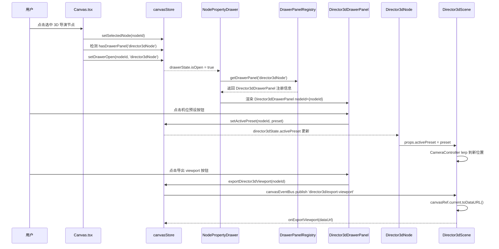

# 架构契约：3D 导演节点控制面板外移至左侧抽屉

> 项目：灰豆AI漫剧神器 (Storyboard Copilot) | 架构师：architect | 日期：2026/05/05

---

## 一、基准审计摘要

### 1.1 当前数据流

```
Director3dNode (useState: mannequins, placedProps, showScene)
  └── Director3dScene (useState: activePreset, selectedCategory)
        ├── <Canvas> (R3F 3D 渲染区)
        └── <div.control-panel> (机位/人物/道具/导出按钮 ← 目标移除区)
```

### 1.2 关键发现

| 发现 | 详情 |
|------|------|
| mannequins / placedProps 为纯局部 useState | 无持久化，刷新即丢失 |
| activePreset / selectedCategory 为局部 useState | 无法被外部抽屉组件访问 |
| canvasStore 已有 selectedNodeId | 可直接复用 |
| Director3dNode 的 mannequinCounter 为模块级变量 | 需迁移至 store 或工具函数 |
| handleExportViewport / handleExportDepth 依赖 canvasRef | 导出触发点与执行点需分离 |
| nodeRegistry 已有 CanvasNodeCapabilities | 可扩展 drawerPanel 能力声明 |
| canvasNodes.ts 的 Director3dNodeData 仅含 backgroundUrl | MVP 不扩展持久化字段 |

---

## 二、ADR — 架构决策记录

### ADR-1: 状态提升至 canvasStore（不新建独立 store）

- **决策**：将 mannequins/placedProps/activePreset 提升至 canvasStore
- **论证**：方案A（Store提升）→ 抽屉可直接通过 useCanvasStore 读写；方案B（Props穿透）→ 三层透传脆弱；方案C（独立Context）→ 多一层抽象
- **风险**：canvasStore 体积增大约 30 行状态 + 50 行 actions；需确保 selector 粒度足够细

### ADR-2: DrawerPanelRegistry 使用 Map 注册机制

- **决策**：使用 Map<CanvasNodeType, DrawerPanelRegistration> 注册表
- **论证**：与现有 nodeRegistry.ts 的 canvasNodeDefinitions 模式一致；类型安全；静态注册无运行时开销
- **风险**：新增节点类型时需同时注册 nodeRegistry + drawerPanelRegistry

### ADR-3: 抽屉宽度固定 280px，画布不位移

- **决策**：抽屉以 position absolute 覆盖在画布左侧，画布不位移
- **论证**：实现简单；画布 viewport 不变；用户可随时取消选中关闭抽屉
- **风险**：抽屉可能遮挡左侧节点

### ADR-4: 导出回调链路 — 事件总线解耦

- **决策**：导出按钮在抽屉触发 store action，通过事件总线通知 Director3dScene 执行
- **论证**：解耦抽屉与 3D 场景；无需 ref 穿透；React ref 不应存入 Zustand store
- **风险**：需确保 nodeId 匹配和 subscription 生命周期正确

---

## 三、模块物理划分

```
src/
├── stores/
│   └── canvasStore.ts                         ← MODIFY
├── features/
│   └── canvas/
│       ├── Canvas.tsx                         ← MODIFY
│       ├── domain/
│       │   ├── canvasNodes.ts                 ← 不变
│       │   ├── nodeRegistry.ts                ← MODIFY: capabilities 新增 drawerPanel
│       │   └── drawerPanelRegistry.ts         ← NEW
│       ├── ui/
│       │   ├── NodePropertyDrawer.tsx         ← NEW
│       │   └── drawerPanels/
│       │       └── Director3dDrawerPanel.tsx  ← NEW
│       ├── nodes/
│       │   └── Director3dNode.tsx             ← MODIFY
│       └── 3d/
│           └── Director3dScene.tsx            ← MODIFY
└── i18n/
    └── locales/
        ├── zh.json                            ← MODIFY
        └── en.json                            ← MODIFY
```

---

## 四、严密契约定义

### 4.1 canvasStore 扩展契约

```typescript
interface Director3dState {
  mannequins: MannequinInstance[];
  placedProps: PlacedPropInstance[];
  activePreset: CameraPreset | null;
  selectedPropCategory: PropCategory;
}

interface DrawerState {
  isOpen: boolean;
  nodeId: string | null;
  nodeType: CanvasNodeType | null;
}

// CanvasState 新增字段:
//   director3dState: Director3dState;
//   drawerState: DrawerState;

// 新增 Actions:
setDrawerOpen(nodeId: string, nodeType: CanvasNodeType): void;
setDrawerClosed(): void;
addMannequin(nodeId: string, pose: MannequinPose): void;
removeMannequin(nodeId: string, mannequinId: string): void;
addPlacedProp(nodeId: string, definition: PropDefinition): void;
removePlacedProp(nodeId: string, propIndex: number): void;
setActivePreset(nodeId: string, preset: CameraPreset): void;
setSelectedPropCategory(nodeId: string, category: PropCategory): void;
exportDirector3dViewport(nodeId: string): void;
exportDirector3dDepth(nodeId: string): void;

// 初始值:
director3dState: {
  mannequins: [],
  placedProps: [],
  activePreset: CAMERA_PRESETS[0],
  selectedPropCategory: 'indoor-furniture',
}
drawerState: {
  isOpen: false,
  nodeId: null,
  nodeType: null,
}
```

### 4.2 DrawerPanelRegistry 契约

```typescript
export interface DrawerPanelRegistration {
  nodeType: CanvasNodeType;
  PanelComponent: ComponentType<{ nodeId: string }>;
  titleKey: string;
  icon: ComponentType<{ className?: string }>;
}

const registry = new Map<CanvasNodeType, DrawerPanelRegistration>();

export function registerDrawerPanel(registration: DrawerPanelRegistration): void;
export function getDrawerPanel(nodeType: CanvasNodeType): DrawerPanelRegistration | undefined;
export function hasDrawerPanel(nodeType: CanvasNodeType): boolean;
```

### 4.3 NodePropertyDrawer 组件契约

```typescript
// 无显式 props — 从 canvasStore 读取 drawerState
// 行为契约:
// 1. 订阅 drawerState.isOpen / nodeType / nodeId
// 2. isOpen false → 渲染 null
// 3. isOpen true → 根据 nodeType 从 registry 获取 PanelComponent
// 4. 渲染抽屉外壳 (固定宽 280px, position absolute, left:0)
// 5. CSS 动画: translateX(-100%) → translateX(0)，transition 180ms ease-out
// 6. z-index: 30
```

### 4.4 Director3dDrawerPanel 组件契约

```typescript
interface Director3dDrawerPanelProps {
  nodeId: string;
}

// 内部分区:
// 1. 机位预设区: 从 store 读 activePreset，调用 store.setActivePreset
// 2. 人物添加区: 从 store 读 ALL_POSES，调用 store.addMannequin
// 3. 道具添加区: 从 store 读 selectedPropCategory，调用 store.addPlacedProp
// 4. 导出区: 调用 store.exportDirector3dViewport / exportDirector3dDepth
// 5. 人物列表区: 从 store 读 mannequins，可逐个 removeMannequin
```

### 4.5 Director3dNode 重构契约

```typescript
// 移除项:
// - useState mannequins, placedProps, showScene
// - handleAddMannequin, handleRemoveMannequin, handleAddProp
// - handleExportViewport, handleExportDepth
// - mannequinCounter (模块级变量)

// 替换为:
// - 从 canvasStore 读 director3dState.mannequins / placedProps
// - showScene 判断: data.backgroundUrl 存在即为 true
// - mannequins/placedProps 直接从 store selector 传入 Director3dScene
```

### 4.6 Director3dScene 重构契约

```typescript
// 移除项:
// - useState activePreset, selectedCategory
// - 底部 div.control-panel 整个区块

// Props 简化:
export interface Director3dSceneProps {
  backgroundUrl: string | null;
  mannequins: MannequinInstance[];
  placedProps: PlacedPropInstance[];
  activePreset: CameraPreset | null;
  onRemoveMannequin: (id: string) => void;
  onExportViewport: (dataUrl: string) => void;
  onExportDepth: (dataUrl: string) => void;
}

// 保留: canvasRef, CameraController, MannequinObject/PropObject 渲染逻辑
```

### 4.7 选中/取消选中联动契约

```typescript
// Canvas.tsx 中 useEffect 监听 selectedNodeId 变化:
// 1. null → setDrawerClosed()
// 2. 有注册面板 → setDrawerOpen(nodeId, nodeType)
// 3. 无注册 → setDrawerClosed()
// 4. 多选 → setDrawerClosed()
// 防抖: 150ms
```

### 4.8 nodeRegistry 扩展契约

```typescript
interface CanvasNodeCapabilities {
  toolbar: boolean;
  promptInput: boolean;
  drawerPanel?: boolean;  // 新增: 该节点类型是否拥有抽屉面板
}
```

### 4.9 导出回调链路契约

```typescript
// 事件总线通道:
// 'director3d/export-viewport' -> { nodeId }
// 'director3d/export-depth'    -> { nodeId }

// Director3dScene 内部:
// useEffect 订阅事件 → 校验 nodeId → 执行 canvasRef.toDataURL() → 回调

// Director3dDrawerPanel 导出按钮:
// onClick → store.exportDirector3dViewport(nodeId)
//   → canvasEventBus.publish('director3d/export-viewport', { nodeId })
```

---

## 五、存储与状态流转设计

### 5.1 状态机 — 抽屉开关

```
[CLOSED] --(选中 director3d)--> [OPEN:director3d]
[OPEN:director3d] --(取消选中)--> [CLOSED]
[OPEN:director3d] --(选中其他非抽屉节点)--> [CLOSED]
[OPEN:director3d] --(多选)--> [CLOSED]
[OPEN:director3d] --(删除当前节点)--> [CLOSED]
```

### 5.2 持久化策略
- MVP 阶段：director3dState 不持久化，刷新后丢失
- 后续迭代（P2）：序列化到 Director3dNodeData

---

## 六、时序与交互流



---

## 七、API 契约清单

| Action | 签名 | 副作用 |
|--------|------|--------|
| setDrawerOpen | (nodeId, nodeType) => void | 设置 drawerState |
| setDrawerClosed | () => void | 重置 drawerState |
| addMannequin | (nodeId, pose) => void | 追加至 mannequins |
| removeMannequin | (nodeId, mannequinId) => void | 从 mannequins 移除 |
| addPlacedProp | (nodeId, definition) => void | 追加至 placedProps |
| removePlacedProp | (nodeId, propIndex) => void | 从 placedProps 移除 |
| setActivePreset | (nodeId, preset) => void | 更新 activePreset |
| setSelectedPropCategory | (nodeId, category) => void | 更新 selectedPropCategory |
| exportDirector3dViewport | (nodeId) => void | 发布事件总线 |
| exportDirector3dDepth | (nodeId) => void | 发布事件总线 |

---

## 八、安全与性能红线

### 8.1 性能
- Zustand selector 粒度：NodePropertyDrawer 必须使用细粒度 selector
- 防抖：selectedNodeId 变化 150ms 防抖
- 3D Canvas 不重渲染：抽屉开关不触发 Director3dScene 重渲染
- Director3dDrawerPanel：使用 React.memo 包裹

### 8.2 安全
- 导出 dataURL 仅在用户主动触发时生成
- nodeId 校验：所有 store actions 中校验 nodeId 对应节点存在且类型匹配

---

## 九、Sprint 规划确认

### Sprint 1：状态层 + 抽屉框架
- F10: canvasStore 扩展
- F2: DrawerPanelRegistry
- F1: NodePropertyDrawer 通用容器
- F3: 选中/取消选中联动

### Sprint 2：3D 导演面板 + 节点重构
- F4-F7: 3D 导演面板四个分区
- F8: Director3dNode 重构
- F9: Director3dScene 重构

### Sprint 3：边界处理 + 文案 + 验收
- F11: 画布布局适配
- F12: 抽屉防抖
- F13: 节点删除时抽屉清理
- F14: i18n 文案补充

---

## 十、i18n 新增 Key 清单

```json
{
  "drawer": {
    "title": "属性面板",
    "director3d": {
      "cameraPresets": "机位预设",
      "mannequin": "人物",
      "props": "道具",
      "export": "导出",
      "exportViewport": "视口",
      "exportDepth": "深度",
      "poseStand": "站",
      "poseSit": "坐",
      "poseLean": "倚",
      "poseLie": "卧",
      "mannequinList": "已添加人物",
      "propList": "已添加道具",
      "noMannequins": "未添加人物",
      "noProps": "未添加道具"
    }
  }
}
```

---

## 十一、Developer 执行核对清单

| # | 检查项 | 易错原因 |
|---|--------|----------|
| 1 | canvasStore 新增字段必须提供初始默认值 | Zustand 不允许 undefined 状态字段 |
| 2 | addMannequin 中的 mannequinCounter 必须迁移至 store 内部或使用 crypto.randomUUID() | 模块级计数器在 Store action 中不可访问 |
| 3 | Director3dScene 的 canvasRef 必须在事件总线订阅回调中使用，不能存入 Store | React ref 不可序列化 |
| 4 | 抽屉组件的 Zustand selector 必须使用细粒度切片 | 全量订阅导致每次 store 更新都重渲染 |
| 5 | Director3dNode 移除 useState 后，mannequins/placedProps 必须从 store selector 读取 | data prop 是 Director3dNodeData，不含 mannequins/placedProps |
| 6 | Director3dScene 移除控制面板后，activePreset 必须从 props 接收 | 否则抽屉修改 store 后 Scene 不响应 |
| 7 | deleteNode/deleteNodes 时必须检查 drawerState.nodeId 是否在删除列表中 | 否则抽屉显示已删除节点的面板 |
| 8 | 抽屉 CSS position absolute 的父容器必须是 Canvas.tsx 的 wrapperRef div | ReactFlow 内部 transform 会随画布平移缩放 |
| 9 | 导出事件总线的 subscription 必须在 Director3dScene unmount 时 unsubscribe | 否则内存泄漏 |
| 10 | i18n key 使用 drawer.director3d.* 前缀 | 抽屉面板文案可能和节点内文案不同 |
| 11 | nodeRegistry.ts 的 capabilities.drawerPanel 新字段为 optional | 不破坏现有节点定义的向下兼容 |
| 12 | 防抖实现使用 setTimeout + clearTimeout，不用 lodash debounce | 项目未引入 lodash |

---

> 架构契约版本：v1.0 | 架构师：architect | 日期：2026/05/05
> PRD 引用：requirements.md | 价值审查：docs/cognition/value-review.md (VERDICT: PASS)
