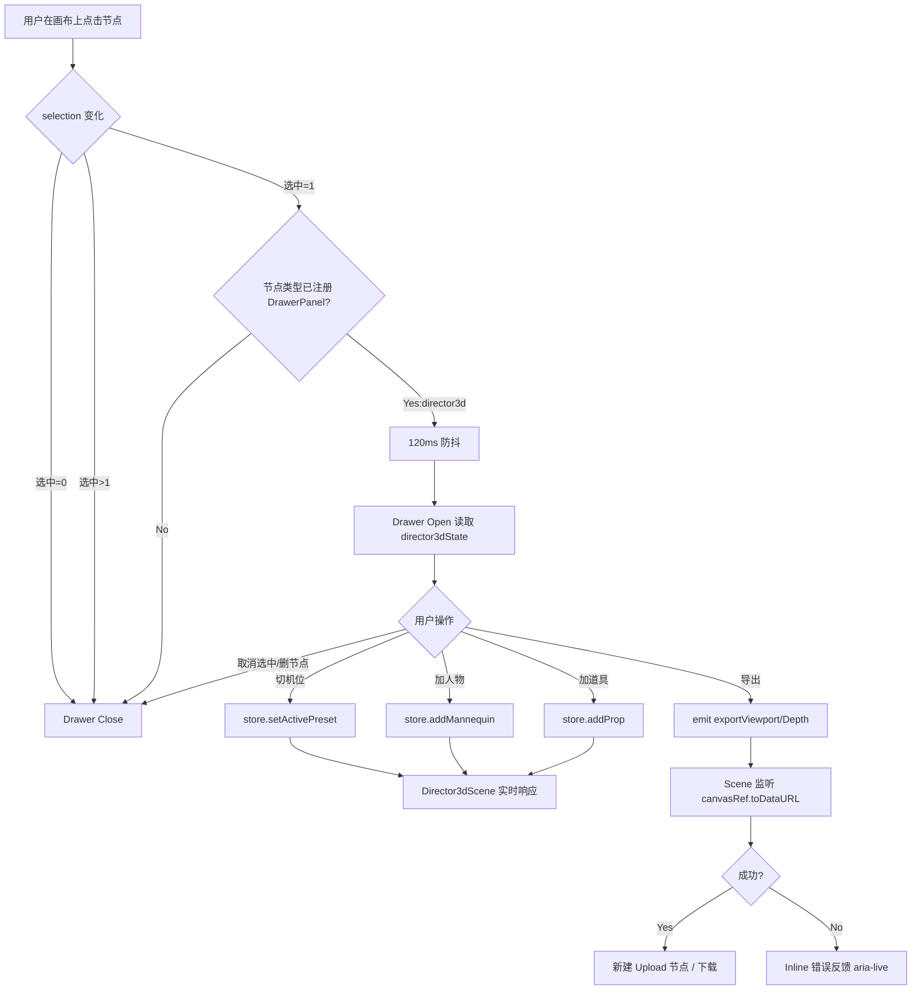

# 灰豆AI漫剧神器 — 3D 导演节点控制面板外移设计规格 v1

## 0. 设计审计（Design System Audit）

| 维度 | 现状 | 设计决策 |
|---|---|---|
| UI 框架 | TailwindCSS + 自研 primitives.tsx（UiButton/UiIconButton/UiChipButton/UiPanel/UiSelect/UiModal） | 复用，禁止引入 AntD/MUI |
| 颜色 token | CSS 变量：--accent、--bg、--surface、--text、--text-muted、--ui-surface-panel、--ui-surface-field、--ui-border-soft/strong | 复用，禁新增色 |
| 圆角 token | --ui-radius-lg/xl/2xl、--node-radius | 抽屉容器使用 --ui-radius-xl(=16px) |
| 阴影 | --ui-shadow-panel | 抽屉使用同款 |
| 动画时长常量 | UI_DIALOG_TRANSITION_MS(180ms)、UI_POPOVER_TRANSITION_MS(160ms)、useDialogTransition | 抽屉滑入复用 useDialogTransition，时长 180ms |
| 节点工具条 | nodeToolbarConfig.ts（不可绕开） | 不影响：本次只动节点内部 |
| Reduce Motion | 现有 prefers-reduced-motion 模式 | 抽屉同样降级到 1ms 瞬时切换 |
| z-index 规范 | UiModal 用 z-50，UiSelect listbox z-[140] | 抽屉用 z-30（高于 ReactFlow 节点 z-1~10，低于 Modal/Toast） |

## 1. 业务规则定义

### 1.1 抽屉开启条件
| 条件 | 抽屉状态 |
|---|---|
| selectedNodeIds.length === 1 且单个选中节点 type === director3d | 打开 |
| selectedNodeIds.length === 0 | 关闭 |
| selectedNodeIds.length > 1（多选） | 关闭 |
| 单选但 type !== director3d（且未注册到 DrawerPanelRegistry） | 关闭 |
| 当前选中的 director3d 节点被删除 | 关闭，并清空 director3dState 对应作用域 |

### 1.2 防抖规则
- selectedNodeId 变化 → 抽屉开关动作经 120ms 防抖

### 1.3 数据约束
| 字段 | 类型 | 约束 |
|---|---|---|
| mannequins[].id | string | mannequin-{counter}，唯一 |
| mannequins[].pose | enum | stand \| sit-chair \| lean-45 \| lie |
| placedProps[].definition.id | string | 来自 props.ts 注册表 |
| activePreset | CameraPreset \| null | null 表示用户自由轨道控制 |
| drawer.scope | nodeId | 当前抽屉绑定的 director3d 节点 ID |

### 1.4 触发点 vs 执行点
| 操作 | 触发点（抽屉） | 执行点（节点/Scene） |
|---|---|---|
| 切机位 | store.setActivePreset(preset) | Director3dScene 内 CameraController 监听 |
| 添加人物 | store.addMannequin(pose) | Director3dScene 渲染 MannequinObject |
| 添加道具 | store.addProp(def) | Director3dScene 渲染 PropObject |
| 导出 viewport | canvasEventBus.emit('director3d.exportViewport', {nodeId}) | Director3dScene 监听 → canvasRef.current.toDataURL() |
| 导出 depth | 同上 | 同上 |

## 2. 业务流向图



## 3. 抽屉布局规格

### 3.1 容器尺寸
| 属性 | 值 | 备注 |
|---|---|---|
| 位置 | position: fixed; left: 0; top: header高度; bottom: 0 | 不进入 react-flow 内部坐标系 |
| 宽度 | W = 280px | 参考图 ~250px，留 30px 给视觉呼吸 |
| 高度 | 100dvh - header | 必须用 dvh 而非 vh |
| 背景 | var(--ui-surface-panel) | 复用 |
| 边框 | 仅右边 1px var(--ui-border-soft) | |
| z-index | 30 | 在 UiModal 50 之下 |

### 3.2 画布让位策略
- 抽屉以 position absolute 覆盖在画布左侧，画布不位移
- 抽屉自身做 translateX(-100% → 0) + opacity 进出动画
- 画布只在抽屉动画结束态切换布局列宽

### 3.3 抽屉内部分区
```
┌─ DrawerHeader (h-12, px-4, border-b) ─────────────┐
│  [Icon Box] 3D 导演 (truncate)              [✕]   │
├──────────────────────────────────────────────────┤
│ [Tab] 机位 │ 人物 │ 道具 │ 导出  (h-10, sticky)  │
├──────────────────────────────────────────────────┤
│   <Tab Panel> ui-scrollbar overflow-y-auto       │
│   px-4 py-3, gap-3                                │
└───────────────────────────────────────────────────┘
```

| 区块 | 高度 | 说明 |
|---|---|---|
| Header | 48px | 节点图标 + 节点 displayName |
| Tab Bar | 40px | sticky top:0 |
| Panel Content | flex-1 | ui-scrollbar overflow-y-auto |

### 3.4 各 Tab Panel 设计

#### Tab A：机位预设
- 布局：grid grid-cols-2 gap-2
- 每项：UiChipButton（h-10），active 状态高亮
- 数据源：CAMERA_PRESETS（10 项）

#### Tab B：人物添加
- 顶部分区："添加姿态"小标题
- 4 个姿态按钮：grid grid-cols-2，每项 UiButton size="sm"
- 下方："已添加"列表，每行 poseLabel + 删除按钮

#### Tab C：道具添加
- 顶部：UiSelect 选择道具分类
- 下方：grid grid-cols-2 gap-2，按分类渲染道具按钮
- 已放置道具列表：可移除

#### Tab D：导出
- 两个 UiButton variant="primary" size="md"，纵向堆叠
- Loading 态：按钮禁用 + spinner
- 错误态：inline role="alert" aria-live="polite"

## 4. UI 状态矩阵

### 4.1 抽屉级状态
| 状态 | 触发 | 视觉 | 可交互 | 动画 |
|---|---|---|---|---|
| Closed | 无选中/多选/非注册节点 | unmounted | — | — |
| Opening | selected → director3d (防抖通过后) | translateX(-100% → 0)，opacity 0 → 1 | pointer-events:none | 180ms ease-out |
| Open | 稳定打开 | 完整可见 | 全部 | — |
| Closing | 取消选中/切其他类型/节点删除 | translateX(0 → -100%)，opacity 1 → 0 | pointer-events:none | 180ms ease-out |

### 4.2 i18n Key 表
| 场景 | zh | en | i18n key |
|---|---|---|---|
| Drawer Header | 3D 导演 | 3D Director | node.director3d.drawer.title |
| Tab 机位 | 机位 | Camera | node.director3d.drawer.tabCamera |
| Tab 人物 | 人物 | Figures | node.director3d.drawer.tabFigures |
| Tab 道具 | 道具 | Props | node.director3d.drawer.tabProps |
| Tab 导出 | 导出 | Export | node.director3d.drawer.tabExport |
| 人物列表空 | 暂无人物，点击上方按钮添加 | No mannequins yet. Add one above. | node.director3d.drawer.emptyMannequins |
| 道具列表空 | 暂无道具，先选择分类并添加 | No props yet. Pick a category first. | node.director3d.drawer.emptyProps |
| 导出失败 | 导出失败：{reason} | Export failed: {reason} | node.director3d.drawer.exportError |
| 导出中 | 导出中… | Exporting… | node.director3d.drawer.exporting |

## 5. 动画规格
| 动画 | 属性 | 时长 | 缓动 |
|---|---|---|---|
| 抽屉滑入/滑出 | transform: translateX + opacity | 180ms | ease-out |
| Tab 切换 | opacity | 120ms | ease-out |

- 禁止：动画 width / height / margin / left / blur / backdrop-filter
- 必须：prefers-reduced-motion 下抽屉直接切换 display

## 6. 无障碍与键盘
| 行为 | 实现 |
|---|---|
| 抽屉容器语义 | aside role="complementary" aria-label="3D 导演属性" |
| 不抢焦点 | 打开时不强制 focus 进入抽屉 |
| 关闭后焦点恢复 | 焦点回到触发节点 |
| Escape 键 | 不关抽屉（抽屉与选择联动） |
| Tab 切换键盘导航 | 左右方向键切换 Tab |
| 图标按钮 | 全部 aria-label |
| 错误反馈 | role="alert" aria-live="polite" |

## 7. 响应式适配
| 视口宽度 | 行为 |
|---|---|
| ≥ 1280px | 抽屉 280px 常驻 |
| 1024 - 1279px | 抽屉 280px，MiniMap 自动避让 |
| < 1024px | 抽屉宽度收窄至 240px |
| < 768px | 抽屉变成全宽 overlay |

## 8. 架构师 Hand-off

### 8.1 canvasStore 新增 state
```ts
interface CanvasState {
  drawer: {
    isOpen: boolean;
    nodeId: string | null;
    activeTab: 'camera' | 'figures' | 'props' | 'export';
  };
  director3dStateByNode: Record<string, {
    mannequins: MannequinInstance[];
    placedProps: PlacedProp[];
    activePreset: CameraPreset | null;
    selectedPropCategory: PropCategory;
  }>;
}
```

### 8.2 canvasStore 新增 actions
| Action | 签名 |
|---|---|
| setDrawerTab | (tab) => void |
| addMannequin | (nodeId, pose) => void |
| removeMannequin | (nodeId, mannequinId) => void |
| addProp | (nodeId, def) => void |
| removeProp | (nodeId, index) => void |
| setActivePreset | (nodeId, preset) => void |
| setSelectedPropCategory | (nodeId, cat) => void |
| clearDirector3dState | (nodeId) => void |

### 8.3 DrawerPanelRegistry 接口
```ts
interface DrawerPanelDef<TData> {
  nodeType: CanvasNodeType;
  panel: React.ComponentType<{ nodeId: string; data: TData }>;
  autoOpenOnSelect?: boolean;
}
```

### 8.4 事件总线契约
| 事件 | payload | 发起方 | 监听方 |
|---|---|---|---|
| director3d.exportViewport | { nodeId } | DrawerPanel | Director3dScene |
| director3d.exportDepth | { nodeId } | DrawerPanel | Director3dScene |
| director3d.exportResult | { nodeId, kind, dataUrl } | Director3dScene | DrawerPanel |
| director3d.exportError | { nodeId, kind, reason } | Director3dScene | DrawerPanel |
